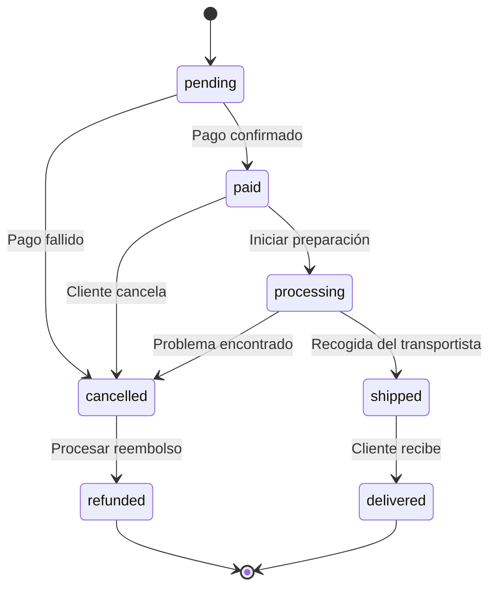

  ## Descripción general

La Plant Store API gestiona el ciclo de vida completo de los pedidos, desde la compra hasta la entrega. Úsala para crear pedidos, procesar pagos, hacer seguimiento del fulfillment y gestionar cancelaciones y reembolsos.

<CardGroup cols={2}>
  <Card
    title="Crea tu primer pedido"
    icon="duotone book-sparkles"
    href="/first-order-tutorial"
  >
    Guía paso a paso para crear y procesar un pedido.
  </Card>
  <Card
    title="Referencia de la API"
    icon="duotone code"
    href="/api-reference"
  >
    Explora los endpoints y los esquemas de pedidos.
  </Card>
</CardGroup>

  ## Estado del pedido

Los pedidos pasan por estos estados:

| Estado | Descripción | Duración típica |
|--------|-------------|------------------|
| `pending` | Pedido creado, a la espera de pago | De minutos a horas |
| `paid` | Pago confirmado, listo para su cumplimiento | De horas a días |
| `processing` | Preparándose para el envío | 1-2 días hábiles |
| `shipped` | En tránsito hacia el cliente | 2-7 días hábiles |
| `delivered` | Recibido correctamente | Estado final |
| `cancelled` | Pedido cancelado antes del envío | Da lugar a un reembolso |
| `refunded` | Pago reembolsado al cliente | Estado final |

<Warning>
  Permite modificaciones del pedido solo antes del estado `processing`. Una vez iniciado el cumplimiento, cancela y crea un nuevo pedido.
</Warning>

  ## Coordinación de pagos e inventario

El procesamiento eficaz de pedidos requiere una sincronización cuidadosa entre los sistemas de pago e inventario. Reserva el inventario inmediatamente cuando se crea un pedido para evitar sobreventas. Si el pago falla o expira, libera la reserva automáticamente. Solo descuenta del stock físico cuando el pedido realmente se envíe.

Para los pagos, autoriza en el checkout para verificar que existan fondos, pero captura (cobra) solo después de validar el inventario y prepararte para el envío. Este enfoque en dos pasos reduce los contracargos de pedidos no cumplidos y mejora la prevención del fraude.

<Tip>
Separar la autorización y la captura te da tiempo para validar el inventario antes de cobrar al cliente. La mayoría de los procesadores de pago admiten un período de 7 días entre la autorización y la captura.
</Tip>

  ## Notificaciones al cliente

Mantén informados a los clientes en cada etapa con notificaciones automatizadas. Envía un correo de confirmación inmediatamente después de crear el pedido, notifica cuando se reciba el pago y proporciona información de seguimiento cuando se envíe el pedido. Hacer seguimiento tras la entrega con instrucciones de cuidado ayuda a garantizar la satisfacción y reduce las solicitudes de soporte.

| Evento | Notificación | Contenido a incluir |
|-------|-------------|-------------------|
| Pedido creado | Correo de confirmación | Detalles del pedido, artículos, fecha de entrega estimada |
| Pago recibido | Confirmación de pago | Importe cobrado, próximos pasos |
| Pedido enviado | Notificación de envío | Número de seguimiento, carrier, fecha de llegada estimada |
| Pedido entregado | Confirmación de entrega | Instrucciones de cuidado, solicitud de reseña |

Actualiza el estado del pedido en tiempo real y registra todos los cambios con marcas de tiempo para crear una trazabilidad de auditoría. Haz que el estado actual sea visible para los clientes en todo momento a través del panel de su cuenta o de las páginas de seguimiento de pedidos.