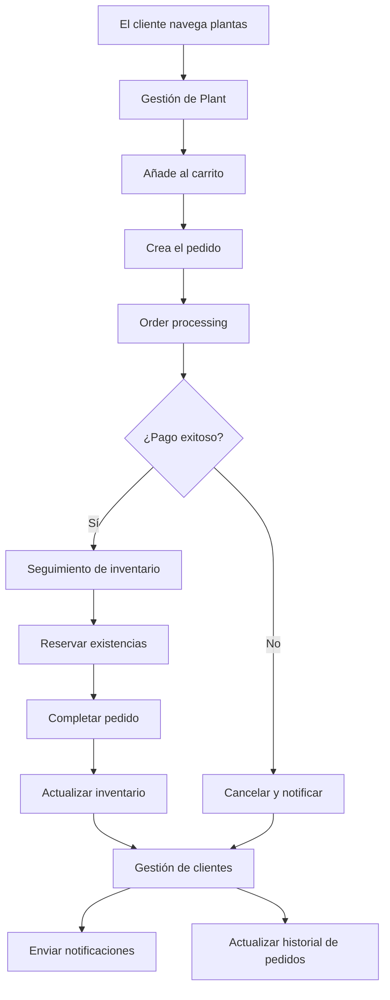

La Plant Store API es una plataforma integral de comercio electrónico diseñada para minoristas de plantas. Gestiona todo, desde la administración del catálogo y el seguimiento del inventario hasta el procesamiento de pedidos y la gestión de relaciones con los clientes.

<div id="what-you-can-build">
  ## Qué puedes construir
</div>

The Plant Store API provides the building blocks for plant retail operations:

<CardGroup cols={2}>
  <Card title="Sitios web de comercio electrónico" icon="duotone store">
    Crea tiendas en línea con inventario en tiempo real, carritos de compra y flujos de checkout.
  </Card>
  <Card title="Aplicaciones móviles" icon="duotone mobile">
    Crea aplicaciones nativas para iOS y Android para explorar Plantas y realizar pedidos.
  </Card>
  <Card title="Sistemas de inventario" icon="duotone boxes-stacked">
    Supervisa el stock en múltiples ubicaciones con alertas automáticas de reabastecimiento.
  </Card>
  <Card title="Paneles de administración" icon="duotone chart-line">
    Administra tu catálogo, procesa pedidos y analiza el comportamiento de los clientes.
  </Card>
</CardGroup>

<div id="core-capabilities">
  ## Capacidades principales
</div>

La API está organizada en torno a cuatro capacidades principales, cada una encargada de un aspecto específico del comercio minorista de plantas:

<CardGroup cols={2}>
  <Card title="Gestión de Plantas" icon="duotone seedling" href="/plant-management">
    Crea y organiza tu catálogo de plantas con metadatos detallados, imágenes y categorías. Controla la disponibilidad a medida que cambia el inventario y permite que los clientes busquen y filtren por nivel de cuidado, entorno o etiquetas.
  </Card>
  <Card title="Procesamiento de pedidos" icon="duotone cart-shopping" href="/order-processing">
    Gestiona el ciclo de vida completo del pedido, desde la compra hasta la entrega. Procesa pagos, realiza el seguimiento del estado de cumplimiento y administra cancelaciones y reembolsos. Cada pedido reserva inventario automáticamente para evitar la sobreventa.
  </Card>
  <Card title="Gestión de clientes" icon="duotone users" href="/customer-management">
    Crea relaciones duraderas con perfiles de clientes detallados, historial de pedidos y preferencias de comunicación. Admite múltiples direcciones de envío, realiza un seguimiento de los patrones de compra y segmenta clientes para marketing dirigido.
  </Card>
  <Card title="Seguimiento de inventario" icon="duotone boxes-stacked" href="/inventory-tracking">
    Mantén niveles de existencias precisos en todos los canales de venta con actualizaciones en tiempo real. Configura alertas automáticas de reposición, reserva inventario para pedidos pending y realiza el seguimiento de cambios con registros de auditoría completos.
  </Card>
</CardGroup>

<div id="how-it-works">
  ## Cómo funciona
</div>

Cuando un cliente navega por tu catálogo, el sistema de gestión de Plant se encarga de la búsqueda y el filtrado. Al crear un pedido, se activa el sistema de order processing, que valida el pago. Si el pago se realiza correctamente, el sistema de seguimiento de inventario reserva existencias y gestiona el fulfillment. A lo largo del proceso, el sistema de gestión de clientes envía notificaciones y mantiene el historial de pedidos. Si el pago falla, el sistema cancela el pedido y notifica automáticamente al cliente.

<Accordion title="Diagrama de arquitectura">

</Accordion>

<div id="rate-limits">
  ## Límites de uso
</div>

Plant Store API tiene los siguientes límites de uso para garantizar un servicio confiable:

| Plan | Solicitudes por minuto | Límite de ráfaga |
|------|------------------------|------------------|
| Gratis | 60 | 100 |
| Pro | 600 | 1000 |
| Enterprise | Personalizado | Personalizado |

Si superas tu límite de uso, recibirás una respuesta `429 Too Many Requests`. Implementa un backoff exponencial para manejar estos errores de forma adecuada.

<div id="sdks-and-libraries">
  ## SDK y bibliotecas
</div>

Los SDK oficiales están disponibles para los lenguajes más populares. Cada SDK gestiona la autenticación, el manejo de errores y el formateo de las solicitudes automáticamente, lo que hace que la integración sea más rápida y confiable que usar directamente la API REST.

<Tabs>
  <Tab title="Python">
    ```bash
    pip install plantstore-sdk
    ```
  </Tab>
  <Tab title="TypeScript">
    ```bash
    npm install @plantstore/sdk
    ```
  </Tab>
  <Tab title="Go">
    ```bash
    go get github.com/plantstore/plantstore-go
    ```
  </Tab>
</Tabs>

<div id="getting-help">
  ## Obtener ayuda
</div>

<CardGroup cols={2}>
  <Card title="Guía de inicio rápido" icon="duotone rocket" href="/quickstart">
    Haz tu primera solicitud a la API en minutos
  </Card>
  <Card title="Referencia de la API" icon="duotone code" href="/api-reference">
    Documentación completa de endpoints
  </Card>
  <Card title="Tutoriales" icon="duotone book-sparkles" href="/searching-plants">
    Guías de integración paso a paso
  </Card>
  <Card title="Soporte" icon="duotone headset" href="https://support.plantstore.com">
    Ponte en contacto con nuestro equipo para obtener ayuda
  </Card>
</CardGroup>

---

<Markdown src="/snippets/note.mdx" />